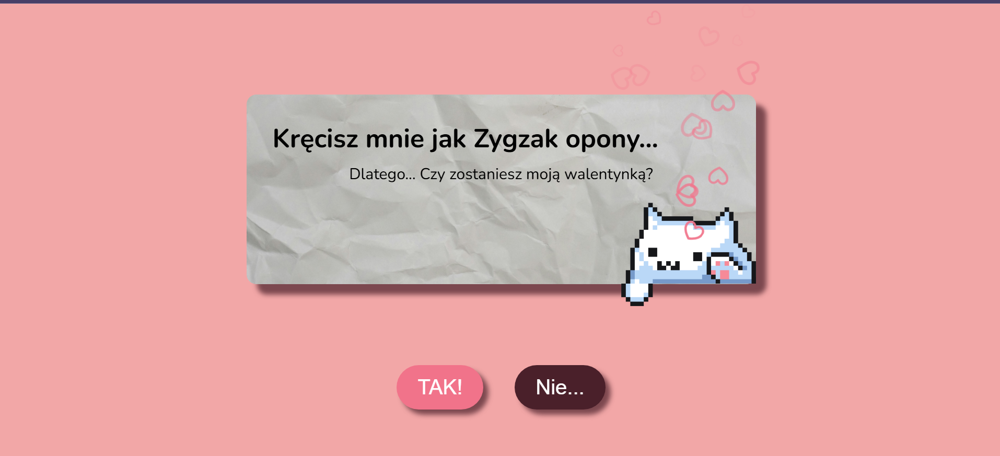
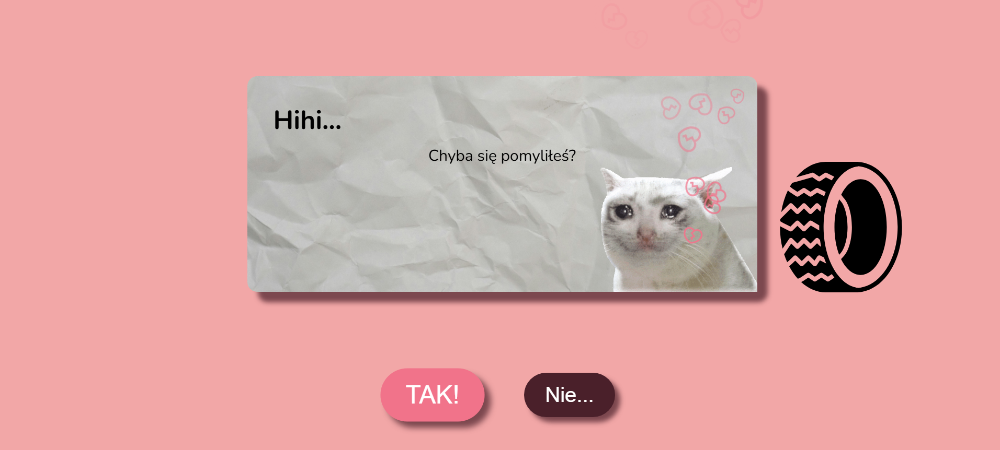
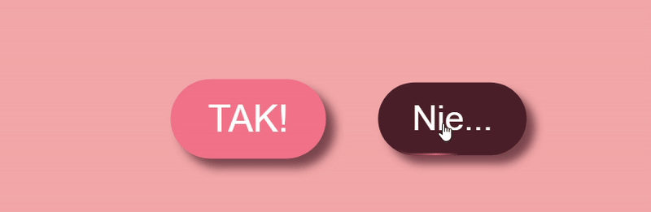
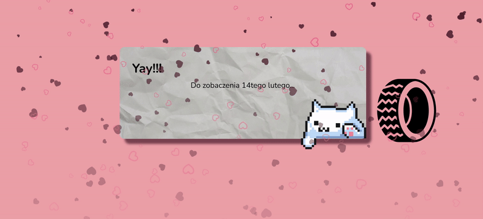

# Valentine's day site - project fo fun 

## A single page application built with Vue and GSAP

> Check out my site in it's full glory: [Valentine](https://bubiwalentynki.netlify.app/)

This is a simple project made for fun. Filled with various animations, this single page application has several js scripts, components and a single view to create this fun-filled experience. It's as interactive as one can get - custom button animations, card shaking, cats to pet and heart confetti at the end to finalize the deal.

This site includes gifs and sound effects that make for a creative, loving mess - in a good way.

---

#### 🛠️ Tech Stack 

* **Framework:** Vue.js 3
* **Animations:** GSAP (GreenSock Animation Platform)
* **Build Tool:** Vite

---

### ⚙️ Installing & Running

Follow the guide beneath to set up the project locally:

1. **Clone the repository:**
   ```bash
   git clone [https://github.com/werAnnOstrowska/valentines.git](https://github.com/werAnnOstrowska/valentines.git)
   cd walentynki-projekt
   ```

2. **Install dependencies**<br>

```
 npm install
```

3. **Run the application**<br>

    ```
    npm run dev
    ```

---

### Showcase







